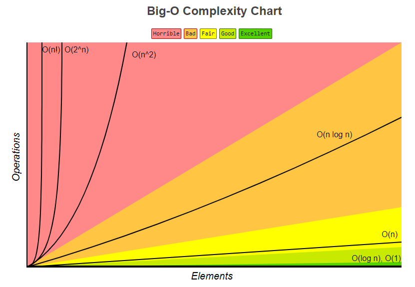

# 1. 알고리즘

알고리즘(algorithm)이란 어떠한 문제를 해결하기 위한 여러 동작들의 모임이다.

_**유한성**_을 가지며, 언젠가는 끝나야 하는 속성을 가지고 있다. 여기서 유한성에 집중해야 한다.

```
 웹 브라우저에서 사용할 수 있는 메모리는 일반적인 데스크톱 애플리케이션의 가용 메모리에 비해 매우 적다. 적은 메모리만 할당받는 주된 이유는 웹 페이지에서 실행하는 자바스크립트가 시스템 메모리를 전부 사용해서 운영체제를 다운시키는 일을 방지하기 위함이다. 메모리 제한은 변수 할당 뿐만 아니라 호출스택, 스레드에서 실행할 수 있는 문장 수에도 영향을 미친다.
즉! 가능한 최소한의 메모리만 사용해야 페이지의 성능을 올릴 수 있다.
```

적은 시간과 적은 자원을 이용해 문제를 해결하는 알고리즘이 좋은 알고리즘이다.


##### 좋은 알고리즘의 분석 기준

* 정확성 : 정당한 입력에 대해서 유한 시간 내에 올바른 답을 산출하는가를 판단.

* 작업량 : 전체 알고리즘에서 수행되는 가장 중요한 연산들만으로 작업량을 측정, 해결하고자 하는 문제의 중요 연산이 여러개인 경우에는 각각의 중요 연산들의 합으로 간주하거나 중요 연산들에 가중치를 두어 계산

* 기억 장소 사용량 : 알고리즘이 필요한 작업을 수행하는 데 필요한 메모리의 사용량

* 단순성 : 얼마나 단순한가를 판단. 복잡한 알고리즘은 분석하기도 어렵고, 분석하기 어려운 알고리즘은 개선하기 어렵다.

* 최적성 :  알고리즘에 더 이상 개선할 부분이 없을 정도로 최적화되어 있는가를 가리키는 기준.

  

# 2. 시간복잡도(feat. 공간복잡도)

우선 알고리즘을 평가하는데 있어 수행시간과 메모리 사용량을 평가 기준으로 두는데 수행시간에 해당하는 것이 *시간복잡도*, 메모리 사용량에 해당하는 것이 *공간 복잡도*이다.

간단하게  말하면 알고리즘의 성능평가는 시간 복잡도와 공간 복잡도를 계산하고 점근적 표기법으로 나타내면 된다.

이 포스팅에서는 시간복잡도를 알아보겠다. (일반적으로 시간복잡도에 비해 공간복잡도는 중요도가 낮다. 물론 중요하지 않은 것 또한 아니다.)

--------

시간 복잡도란 알고리즘이 문제를 해결하기 데 걸리는 시간과 입력 함수 관계를 가리킨다. 시간을 측정하는 것이 아니다. 이러한 물리적 측정 방법으로는 성능 비교를 할 수가 없다. 대신 연산의 실행 횟수를 카운트한다.


연산 횟수를 카운팅할 때 3가지 경우가 있다.

1. 최악의 경우 시간복잡도
2. 평균의 경우 시간복잡도
3. 최선의 경우 시간복잡도


최선의 경우는 별로 도움이 되지 않는다. 평균의 경우는 이상적으로 보이지만 알고리즘이 복잡할 수록 구하기가 어렵다. **최악의 경우**는 최소한의 보장을 약속한다.


# 3. 점근 표기법

점근 표기법(Asymptotic Notation)이란 알고리즘의 수행시간을 대략적으로 나타내는 방법으로 데이터의 개수가 n → ∞일 때 수행시간이 증가하는 growth rate로 시간복잡도를 표현하는 기법이다.

유일한 분석법도 아니고 가장 좋은 분석법 또한 아니다. 왜 사용하는가?

알고리즘의 실행환경에 비의존적이다. 따라서 보다 객관적인 비교가 가능하다.


대표적으로 사용하는 점근 표기법에는 3가지 경우가 있다.

1. Ο(Big O) 표기법 : 최악인 경우의 알고리즘 수행시간을 나타낸다.
2. Ω(Big Omega) 표기법 : 최선의 경우의 알고리즘 수행시간을 나타낸다.
3. Θ(Big Theta) 표기법 : 위의 두 가지를 동시에 나타낸다.


------

### 3-1. Ο(Big O) 표기법

* 빅 오 표기법 :  최악인 경우의 알고리즘 수행시간을 나타낸다. 수행시간의 상한을 나타내며 어떤 최악의 상황에서도 성능을 보장한다. 가장 보편적인 표기법이다.


* 빅 오 표기법의 특징 : 상수항을 무시하고 영향력없는 항을 무시한다.  예를들면 이렇다.

  O(2n² + 4n)  →  O(n²)


>  한편 점근 표기법은 증가 함수를 단순화한다는 특성 때문에 알고리즘의 성능을 대표적인 몇가지 유형으로 추릴 수 있다는 장점이 있다.

| 가 함수 | 설명                                                         | 사례    |
| :--------------- | :----------------------------------------------------------- | ------------------------------------------------------------ |
| O(1)       | 해당 알고리즘이 최악의 경우에도 일정한 상수 시간에 종료된다. | 해시테이블 |
| O(log n)   | 최악의 경우에도 입력 값 n이 증가하는 속도보다 수행 시간이 증가하는 속도가 느린 알고리즘의 성능을 나타낸다. | 이진탐색 |
| O(n)       | 최악의 경우 입력 값 n만큼의 수행 시간을 요구하는 성능이다. 입력 값 n이 증가하는 속도만큼 수행시간도 같은 속도로 증가한다. | 순차탐색 |
| O(n log n) | 로그 함수가 사용되기는 했지만, O(log₂n)와는 비교할 수 없을 정도로 수행시간이 길다. O(n) 알고리즘보다 훨씬 수행시간이 길다. | MergeSort, QuickSort |
| O(n²)      | 최악의 경우 입력 값 n에 대해 제곱으로 수행시간이 늘어나는 성능이다. 똑같이 n회만큼 반복하도록 되어 있는 for문이 2개 중첩되어 있으면 이러한 성능이 나온다. | BubbleSort, InsertionSort |
| O(2ⁿ)      | 입력 값 n에 대해 최대 2의 n제곱만큼 수행시간이 증가한다. n이 10이라고 해도 수행시간은 1024가 된다. |  |


​                          **_faster_**    O(1)  <  O(log₂n)  <  O(n)  <  O(n log n)  <  O(n²)  <  O(2ⁿ)  <  O(n!)    **_slower_**


------

### 3-2. Ω(Big Omega) 표기법

* 빅 오메가 표기법 : 최선인 경우의 알고리즘 수행시간을 나타낸다. 수행시간의 하한을 나타내며 아무리 좋은 케이스여도 이상의 성능은 불가하다.

해당 표기법은 굳이 사용하지 않는다.


------

### 3-3. Θ(Big Theta) 표기법

* 빅 세타 표기법 : 상한과 하한을 동시에 나타낸다. 아무리 좋거나 나빠지더라도 비교하는 함수의 범위 안에 있다. 빅 오 표기법 다음으로 많이 쓰인다.

------

###### 참고문헌
<https://feel5ny.github.io/2017/12/09/CS_01/>
<https://www.bigocheatsheet.com/>

